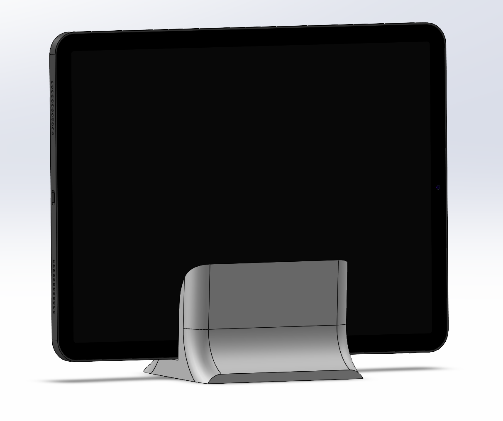
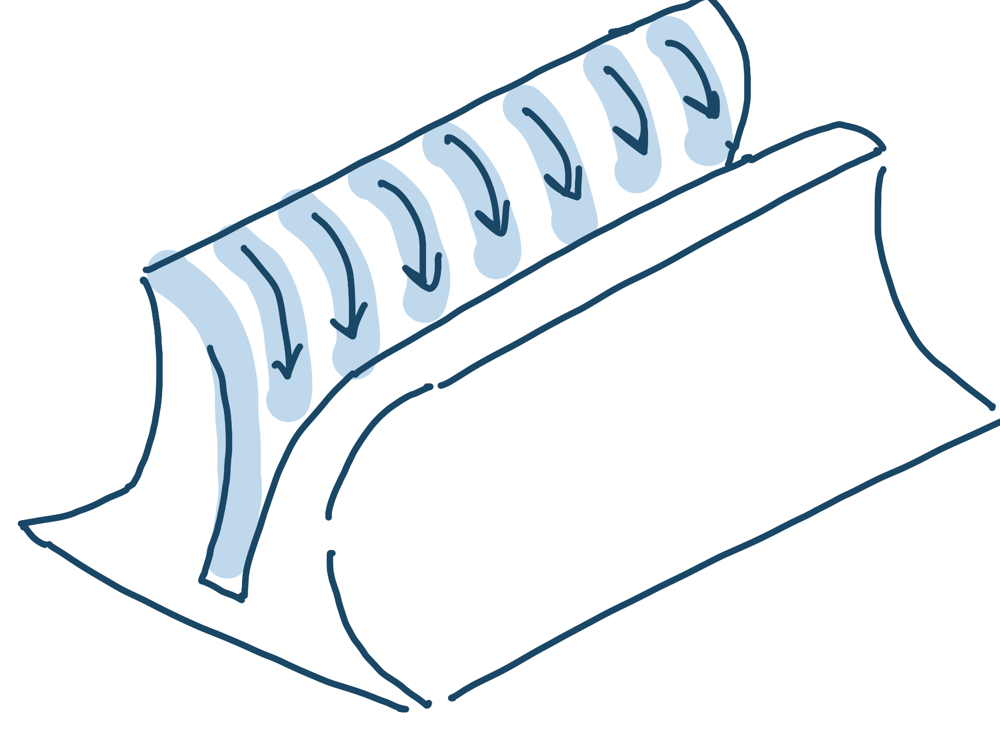

# Ipad_Stand

This stand was designed specifically for an iPad Air 10th generation, providing a secure and comfortable way to hold the device in place when it's not in use or while charging. The design emphasizes sleekness, compactness, and ease of use.

  

## Downloading CAD File
The CAD work was completed using SolidWorks 2023. Both the SLDPRT and STL files are available in the repository for download and use.

## Design Process
The design process for this project was straightforward. The goal was to create a stand that could simply hold an iPad when it wasn't being used.

I drew inspiration from various stands and docks, such as the charging dock for the Nintendo Switch. I appreciated the straightforward design of the Switch dock, which securely holds the device upright. Given that I would be 3D printing this stand, I modified the shape to prevent it from tipping over if bumped. To enhance stability, I added fillets to both sides. A sketch of this can be seen below:

  

The client requested that the stand be easy to use, meaning the iPad should be easy to place without needing precise alignment. To achieve this, I curved the top of the dock, providing a larger tolerance for the iPad to easily slide into place. A sketch of this design can be seen below:

  

To create the CAD model, I took precise measurements of the iPad to ensure a snug fit, allowing the device to stand relatively upright.

PDF of (very) condensed design process in form of sketches: [PDF_Sketches](IPad_Stand.pdf).

## Credits

The "iPad" featured in the image above is a model I downloaded off of GrabCAD. The link to this model can be found here: https://grabcad.com/library/apple-ipad-air-1
